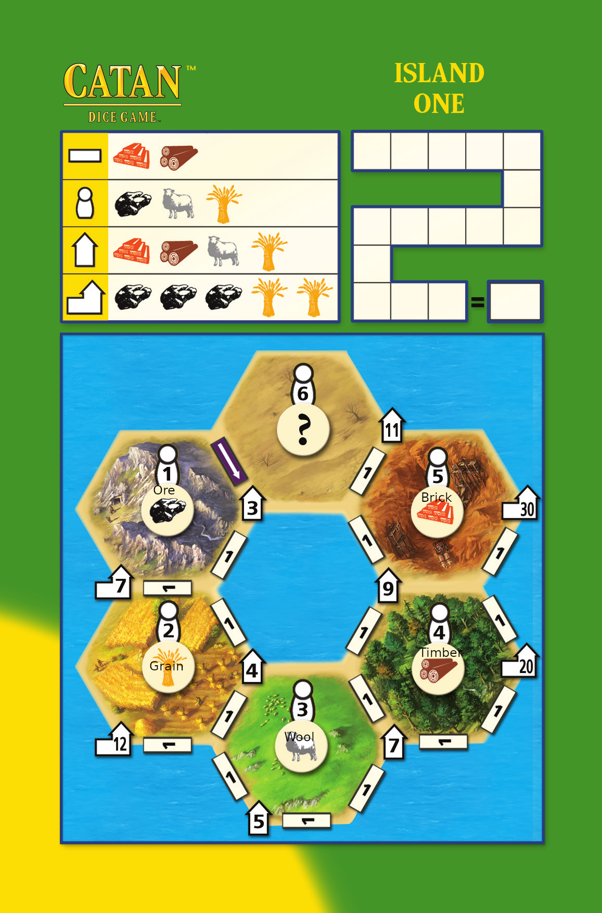
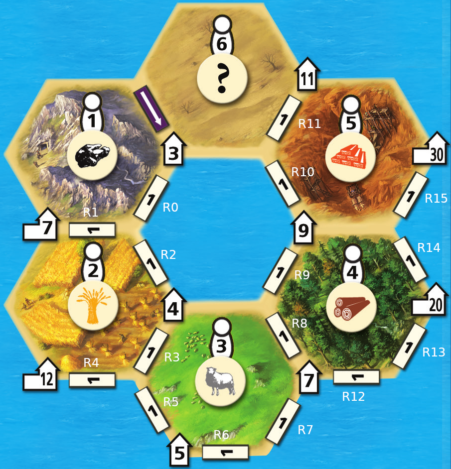

# Island One Catan Dice Game

In this project we *worked as a group* to master a number of major
themes, including software design and implementation, group
work, using development tools such as Git and IntelliJ, and using JavaFX to
build a user interface.  **Above all, this project emphasized group
work**;

## Problem Description

The task was to implement in Java, using JavaFX, a board game called the
[Catan Dice Game](https://www.catan.com/dice-game).
Important: The Catan Dice Game comes with two variants, called "Island One"
and "Island Two": **you will implement the Island One game**.
You can find the game rules, and a PDF of the score sheet (game map) on the
web page linked above.
You can also find several video tutorials explaining how to play the game
on-line, for example <https://www.youtube.com/watch?v=DNZ4tXhnBFA>.

Catan Dice Game is a spin-off (one of many) of the "Settlers of Catan" game
series. There are even several Catan dice games (for example,
"Catan Dice Game XXL"). If you search for information or answers about the
game on-line, make sure what you read actually refers to the
**Catan Dice Game**, not one of the many other games in the series.

## Game Overview

Catan Dice can be played by one or more players. Each player has their own
score sheet (map), and players take turns rolling dice to obtain resources
and using those resources to build structures on their map. All things built
contribute to a player's score, and the player with the highest score at the
end of the game is the winner. (If playing solo, you simply attempt to
maximise your score.)

An overview of the game rules is given below. Use this, in addition to the
resources linked above. If anything is unclear, please consult Piazza for
clarification.

### The Game Board

The game board (or map) has four types of buildable structures: Roads
(rectangles, on the edges between the hexagonal tiles), Settlements
(the small house-like shapes at tile corners), Cities (the larger house
shapes, also at tile corners) and Knights (the figures near the centre
of each tile). Initially, only one road (the filled one, with an arrow on)
is built; all other structures are unbuilt. As a player builds structures,
they mark them off on their map by filling them in.
All buildable structures on the map have a number on them, which is their
points value. All roads are worth 1 point, while settlements, cities and
knights have varied points values.

### Resources

There is six different types of resources: Ore, Grain, Wool (represented
by a sheep), Timber, Bricks and Gold. Each structure has a build cost, which
is the resources a player must have available to build it. For example,
building a Road consumes 1 Brick and 1 Timber. The build costs are summarised
at the top of the score card. Gold is not used to build anything, but can
be traded for other resources (see "Trades and Swaps" below).

### Player Turn

On their turn, a player first rolls the dice (there are six of them). Each
die is marked with the six different resources in the game.

After rolling, the player may select a number of dice to re-roll, and after
the first re-roll may again select a number of dice and roll a third time.

Next, the player can trade and/or swap resources (using Knights), and use
resources to build. A player can build more than one structure on the same
turn, as long as they have enough resources to build all of them. Building
actions are done in sequence, so that conditions required to build a
structure (see "Building Constraints" below) do not necessarily have to
be satisfied at the start of the turn. For example, a player may build a
Road to reach a Settlement, and then build that Settlement, on the same
turn. Also note that building and swapping can be interleaved: a Knight
can be used to swap a resource on the same turn that the knight was built
(but only after it has been built, of course).

When a player cannot take any more actions, they sum up the points values
of all structures built during the turn and add that to their running score.
Resources remaining at the end of the turn are lost (i.e., there is no
accumulation of resources between turns).
Important rule: If a player does not build any structure during a turn,
they get a penalty of -2 points for that turn, added to their running
score.

### Building Constraints

In addition to having the resources available, there are certain constraints
on the order in which structures can be built:

*   Roads, Settlements and Cities must form a connected network, starting
    from the initial Road.

*   Settlements, Cities and Knights must be built in order of increasing
    points value. For example, a player must have built both the 7-point and
    12-point Cities before they can build the 20-point City.

### Trades and Swaps

A player can change their resources in two ways: trading Gold for other
resources, at a rate of 2:1, or swapping resources using Knights.

To trade, the player simply exchanges two Gold for one resource of their
choice.

A Knight, once built, can be used once per game to swap a resource. The
Knights numbered 1 through 5 each allow the player to swap one available
resource of their choice for Ore, Grain, Wool, Timber and Bricks,
respectively. (This is shown by a resource icon below each Knight on the
game map.) Knight number 6 is wildcard: it can be used to swap one
available resource of the player's choice for one of any other resources
(including Gold).

### Game End

The game ends after all players have had 15 turns. The winner is the player
with the highest score.

## Encoding the Game State

The following text encoding is used by the `CatanDice` class to interface
with the tests we provide for the various tasks.
You are strongly encouraged to use your own internal representation of the
game, and convert to and from the text encoding as required to fulfill the
tasks. The text representation is *neither robust nor convenient* to work
with, hence why you should use your own representation.

We encourage you to create your own tests. Your tests can interface
directly with your code. Do not edit the supplied tests, instead
add new files.

We will use different encodings to represent different aspects of the game:

*   A _board state_ is a string that encodes the state of one player's map.
*   A _resource state_ encodes the resources available to a player.
*   An _action_ string specifies a player action (a build, trade or swap);
    an array of action strings specifies a sequence of actions. This
    encoding will be used to test the validity of action sequences, and
    for you to output multi-action plans for a player.

A complete state of the game is made up of:

*   The number of players.
*   The board state of each player.
*   Whose turn it currently is (i.e., the current player's index)
*   The resource state of the current player.
*   How many turns have been completed.
*   The accumulated score of each player.

We do not define a string representation for the complete game state,
since none of the test/task methods need it. Each of the pre-defined
methods in the `CatanDice` class will take as arguments suitable
representations of the aspects of the game that are needed for the task.

### Board State

The board state is made up of the state of the buildable structures on the
map. Roads, Settlements and Cities have only two states: unbuilt or built.
Because each Knight can be used for a resource swap only once during a game,
Knights have three states: unbuilt, built and unused, or built and used.
Since the default (starting) state of all structures is to be unbuilt, we
will not represent unbuilt states explicitly. The board state encoding
is a comma-separated list of structures that have been built.

The string encoding of a single structure consists of a letter indicating
its type (and, in the case of Knights, state) followed by a number that
identifies which one it is. The letters and their meanings are:

*   `R`: a Road
*   `S`: a Settlement
*   `C`: a City
*   `J`: an unused Knight (these are called "resource Joker" in the game
    rule book).
*   `K`: a used Knight.

Roads are numbered as shown in the image below:

Settlements, Cities and Knights are identified by their points value.

For example, `"R0,S3,R2,K1,J2"` specifies a state in which Roads 0 and 2,
the 3-point Settlement, and the 1-point and 2-point Knights are built,
and the 1-point Knight has been used but the 2-point Knight is still
unused.

### Resource State

A resource state is an array of six integers, representing the quantity
available of each of the six resources. The order of the resources is
(0) Ore, (1) Grain, (2) Wool, (3) Timber, (4) Bricks and (5) Gold.
For example, the array `{ 1, 0, 1, 2, 0, 2 }` indicates that the player
has 1 Ore, 1 Wool, 2 Timber and 2 Gold available. Note that the total
quantity of resources can vary.

### Actions

An action string consists of an action keyword, followed by one or more
arguments, each separated by a single space (` `). The format of the
arguments depends on the action keyword. The three possible actions are:

*   `"build"`: followed by a single structure identifier, as described
    in the definition of the board state above. For example, `"build R2"`
    means build Road 2, `"build J1"` means build the 1-point Knight (we
    use `J` instead of `K` since a Knight is always built in its unused
    state).

*   `"trade"`: followed by a single digit `0`-`5` specifying which
    resource to trade for. (Since the payment for a trade is always
    2 Gold, we do not have to including it in the action specification.)
    For example, `"trade 4"` means to trade 2 Gold for 1 Brick.

*   `"swap"`: followed by two digits `0`-`5` specifying the resource
    swapped out and the one it is exchanged for. For example, `"swap 1 4"`
    means exchanging 1 Grain for 1 Brick.

Note that the swap action is not unambiguous: In the example above, if
the player has both the 5-point (Brick) and 6-point (wildcard) Knights
available (built and unused), the swap can be performed using either of
the two. However, since it is always better to use a resource-specific
Knight (keeping the wildcard unused gives more future options), we can
assume that swaps will be executed using resource-specific Knights first,
and the wildcard Knight only when necessary.

An action sequence is represented by an array of action strings.

* The game must run using Java 17 and JavaFX 17.
* The implementation respects the specification of the game rules
  given here.
* The game is easy to play.
* The game runs in a 1200x700 window.
* The game is executable on a standard lab machine from a jar
  file called `game.jar`,

The game should successfully run from `game.jar` from within another
user's account on a standard machine. In
other words, the game does not depend on any features not self-contained
within that jar file and the Java 17 runtime.

(The game can be update for a multiplayer inferface)
 (Need to upload multiplayer version)

